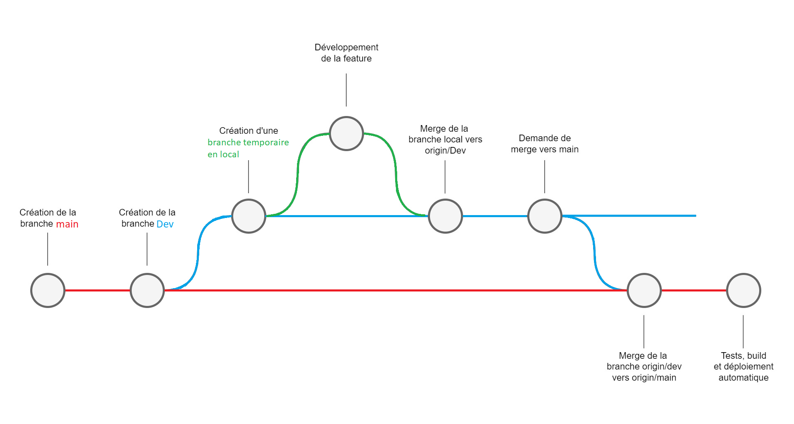

# Projet devOpsIsitech
Notre projet est un terminal de commande conçu pour afficher des informations sur le cours de DevOps. Le terminal est construit en utilisant la bibliothèque React et permet aux utilisateurs d'interagir à travers des [commandes](#comment-utiliser-le-projet).

# Table des Matières
- [Installer le projet](#comment-installer-le-projet)
- [Utiliser le projet](#comment-utiliser-le-projet)
- [Technos & Conventions](#technos--conventions)
- [Workflow Git](#workflow-git)
    - [Exemple d'Ajout de Feature](#exemple-dajout-de-la-feature-n12)
    - [Exemple d'Ajout de Fix](#exemple-dajout-de-fix)
    - [CI/CD](#cicd)

### Membre du Projet
- Louis Maupas & Lucas Michon

## Comment installer le Projet 

1. `git clone https://github.com/LouisMaupas/devOpsIsitech.git`

2. `cd devOpsIsitech/devOpsIsitech`

3. `pnpm install`

4. `pnpm run dev`

## Comment utiliser le projet
> Tapez `help` pour avoir la liste des commandes

# Technos & Conventions
- Gestionnaire de paquets : pnpm  
- Front : React  
- Frontend dev env / builder : Vite  
- Test : Jest  
- Linter : EsLint  
- Versionning et travail collaboratif : Git / Github  
- Plateforme de CI/CD : Github Actions  
- Hebergement : Vercel 
- Messages de commits : [Conventional Commits](https://www.conventionalcommits.org/en/v1.0.0/)
- Utilisation de tag pour le versionning selon le standard de Gestion sémantique de version 2.0.0


# Workflow CI/CD
- **main** : branche principal, contient le code qui va en production.
- **Dev** : branche tampon entre main et les branches de feat/fix
- **feat# / fix# / ...** : branche temporaire crée à partir de dev, dédiée à la résolution d'un bug ou création d'une nouvelle feature. Elle est fusionné à main puis supprimée une fois le ticket clos ou la feature ajoutée.  

*Voir ci-dessous pour le schéma récapitulatif du Workflow*



## Exemple d'ajout de fix
1. Un premier développeur va ouvrir un ticket (issue) sur Github.
2. Le développeur à qui est assigné le ticket suit le [Workflow](#exemple-dajout-de-la-feature-n°12)

## Exemple d'ajout de la feature n°12

1. Création d'une nouvelle branche locale nommée feat#12 à partir de la branche Dev

    ```powershell
    git switch -c feat#12
    ```
2. En local, le développeur code la feature et commit avec squash si nécessaire.

3. Une fois la feature terminée, le développeur push directement sur Dev (avec squash des commits si nécessaire)  
    - `git checkout Dev ` ou `git switch Dev` pour switch sur la branche Dev.
    - `git pull ` ⚠️🔺 pour vérifier qu'on est à jour 🔺⚠️  
    - `git merge currentFeatureOrFix` on fusionne la branche currentFeatureOrFix avec la branche dev.
    - `git push ` on push sur la branche distante (origin/Dev).
    - `git tag -a vX.X -m "Description"` si nécessaire ajouté un tag...
    - `git push --tags` ...et l'envoyer.

4. Sur Github, le développeur fait une demande de merge  de la branche origin/Dev vers origin/main : **Create Pull Request**  
5. Un second développeur doit commenter, approuver ou demander des changement sur la demande de merge.
6. La CI/CD s'active

## CI/CD

1. `actions/checkout@v2` :  est l'étape pour récupérer les sources de l'application depuis le référentiel Git.
2. `Install Vercel CLI` :  installe la dernière version du CLI Vercel.
3. `Clear Cache` : vide le cache  
4. `Install Dependencies` : installe les dépendances pour l'application.
5. `Lint` : execute l'outil de linting pour vérifier la qualité du code.
6. `Tests` : execute les tests unitaires.